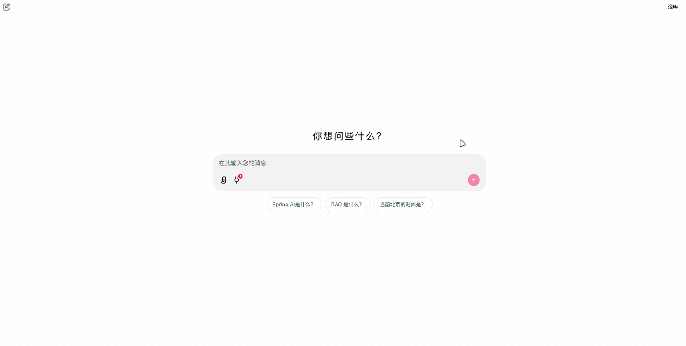

## 通过chainlit构建一个多轮对话示例

> 仅用于演示结合MCP的多轮对话，无法直接在生产环境中使用。

### 介绍

`chainlit`官方MCP示例使用了`claude`连接，本实例将采用`openai`的格式进行模型调用，并做了**tool call**到**MCP**请求的格式转换，方便理解在实际情况中，调用MCP会经历哪些步骤，帮助学习流程。

### 环境要求

- Python 3.12 或更高版本
- uv 包管理器

### 安装

#### 1. 克隆项目：

```bash
git clone https://github.com/CynicalHeart/chat-with-mcp.git

cd chat-with-mcp
```

#### 2. 安装依赖：
使用 uv 创建虚拟环境并安装依赖：

```bash
uv venv
uv pip install -e .
```

#### 3. 配置环境变量：

复制 .env.example 文件为 .env，并填写必要的配置信息：

```bash
cp .env.example .env
```

编辑 .env 文件，填入以下信息：

```env
# key值必填
API_KEY= your_deep_seek_api_key_here_or_other
# 地址&模型名称信息选填，如果不填则使用默认模型DeepSeek的chat-model
BASIC_URL=
MODEL_NAME=
```

支持openai格式的任意模型，如deepseek、火山引擎、混元、openrouter等。

### 运行项目

```python
python main.py
```

服务将在 http://127.0.0.1:8080 运行。

### 功能说明

1. 添加一个或者多个MCP服务器；
2. 验证连接状态；
3. 用户发送问题，LLM判断是否使用工具，并调用MCP服务器；
4. LLM模型结合MCP的返回结果，生成最终回答；

### 功能演示

示例中添加了一个Bilibili热搜MCP服务器，并演示了如何通过该服务器获取热搜榜单信息，结合LLM模型生成回答。



### 许可证

[MIT License](LICENSE)